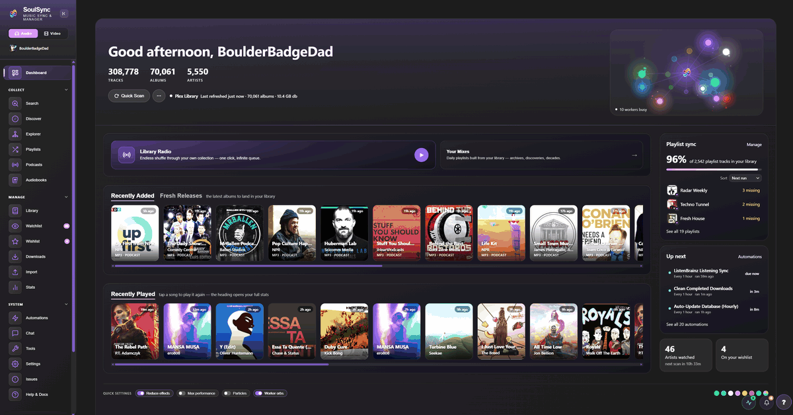
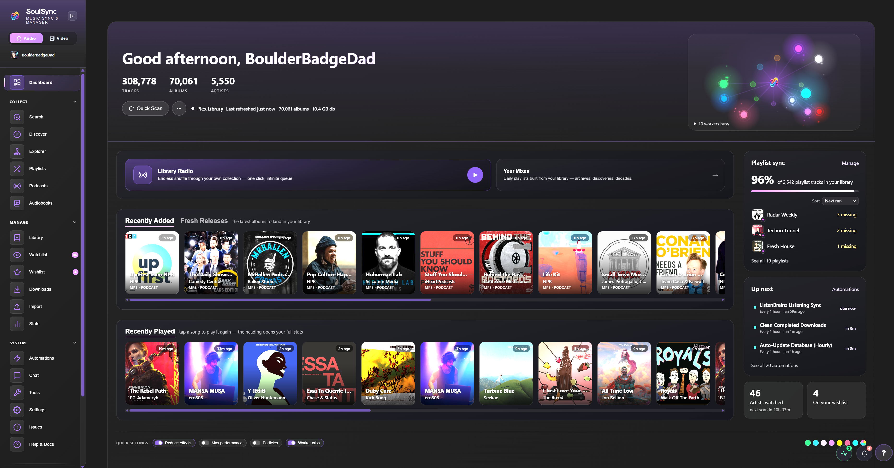

<p align="center">
  
</p>

<h3 align="center">The self-hosted home for your music, movies, TV and YouTube.</h3>

<p align="center">
  Find it, fetch it, verify it, tag it, file it, play it. SoulSync replaces a stack of *arr apps, taggers and scripts with one app that actually knows your library.
</p>

<p align="center">
  <a href="https://github.com/Nezreka/SoulSync/releases"></a>
  <a href="https://hub.docker.com/r/boulderbadgedad/soulsync"></a>
  <a href="https://discord.gg/wGvKqVQwmy"></a>
  <a href="./license.txt"></a>
  <a href="https://ko-fi.com/boulderbadgedad"></a>
</p>

<p align="center">
  <a href="https://www.ssync.net/">Website</a> ·
  <a href="https://discord.gg/wGvKqVQwmy">Discord</a> ·
  <a href="#installation">Install</a> ·
  <a href="#setup-guide">Setup guide</a> ·
  <a href="https://github.com/Nezreka/SoulSync/issues">Issues</a>
</p>

<p align="center">
  
</p>

> [!IMPORTANT]
> If you use Soulseek, **share files in slskd** (`http://localhost:5030/shares`). Leechers get banned by the network.

---

## Contents

- [Why SoulSync](#why-soulsync)
- [At a glance](#at-a-glance)
- **Music**
  - [Dashboard](#dashboard) · [Playlist sync](#playlist-sync) · [Search & downloads](#search--downloads) · [Quality, verification & tagging](#quality-verification--tagging)
  - [Discover](#discover) · [Library & artist pages](#library--artist-pages) · [Watchlist & wishlist](#watchlist--wishlist) · [Import](#import)
  - [Tools & library maintenance](#tools--library-maintenance) · [Listening stats & scrobbling](#listening-stats--scrobbling) · [Player & radio](#player--radio)
  - [Podcasts & audiobooks](#podcasts--audiobooks)
- **Video**
  - [Movies, TV & YouTube](#video-movies-tv--youtube)
- **Platform**
  - [Automations](#automations) · [Profiles & access](#profiles--access) · [Chat & arcade](#chat--arcade) · [API & webhooks](#api--webhooks) · [Mobile, PWA & theming](#mobile-pwa--theming)
- [Installation](#installation) · [Setup guide](#setup-guide) · [Architecture](#architecture) · [Contributing](#contributing) · [License](#license)

---

## Why SoulSync

Most self-hosted media setups are a relay race: one app wants things, another searches, a third downloads, a fourth tags, a fifth tells the server, and when a handoff fails nobody notices. SoulSync runs the whole race itself and keeps the receipts.

- **It knows what you own.** Every search, playlist and recommendation is checked against your real library, so "missing" means missing.
- **It checks its work.** Downloads are fingerprinted, sanity checked, quality ranked and quarantined when they don't hold up. Nothing lands in your library on faith.
- **It explains itself.** Stuck wishlist rows show exactly which releases were refused and why. Every download has an audit trail.
- **It's one app for the whole house.** Music, movies, TV, YouTube, podcasts and audiobooks, with profiles so everyone gets their own taste, playlists and history.

## At a glance

| | |
|---|---|
| **Download sources** | Soulseek (slskd), Tidal, Qobuz, Deezer, HiFi, Amazon Music, YouTube, SoundCloud, Lidarr, Torrent and Usenet (via Prowlarr). One source or a drag-ordered hybrid chain. |
| **Metadata** | Spotify (with or without an account), Apple Music / iTunes, Deezer, Discogs, MusicBrainz, plus 14 background enrichment workers |
| **Media servers** | Plex, Jellyfin, Navidrome, or **SoulSync Standalone** (no server needed) |
| **Playlist sources** | Spotify, Tidal, Qobuz, Deezer, YouTube, YouTube Music, Apple Music links, ListenBrainz, Last.fm, Beatport, SoulSync's own mixes, and CSV / TSV / TXT / M3U files |
| **Video** | Movies, TV and YouTube channels with TMDB / TVDB, Prowlarr, qBittorrent / Transmission / Deluge / SABnzbd / NZBGet, Plex and Jellyfin |
| **Automation** | Visual WHEN → DO → THEN builder, 60+ triggers and actions, Discord / Telegram / Pushbullet / webhook notifications |
| **Runs on** | Docker (amd64 + arm64), Unraid, or plain Python 3.11 |

---

# Music

## Dashboard

<p align="center"></p>

The home screen is split in two: your music on the left, the machine on the right.

- **Hero** with a greeting, your library size, one-click **Quick Scan** and a menu for deep scans, match verification, repair and database backups.
- **Worker orbs**: every enrichment worker lives on its own animated stage. They drift while resting, pulse when busy, turn red on errors, and fly home into a grid of controls when you hover.
- **Library Radio** and **Your Mixes**, **Recently Added / Fresh Releases**, and **Recently Played** (tap a song to play it again; repeats fold into one card).
- **Playlist sync health**: one honest number for how much of your playlists you own, the playlists missing the most, sorting by missing / last synced / next run / name, and running syncs pinned to the top.
- **Up next**: the next automations to fire, with run and pause on hover.
- An **alerts band** that stays invisible until a connection actually breaks.

## Playlist sync

Bring a playlist in from anywhere, keep a mirror of it, and keep your media server's copy in step on a schedule.

- **Add playlist**: paste any link and SoulSync works out the service, or pick from a connected account, or drop a CSV / TSV / TXT / M3U file and map its columns.
- **Mirrored library**: every playlist as a card whose artwork carries its state (a coverage ring, a pulse while syncing, desaturated when something's wrong). Filter by *Needs attention / Working / Discovered / Scheduled*, search, sort, bulk delete.
- **Discovery**: matches each source track to real metadata with live progress. Fix any match by hand (including by MusicBrainz ID), retry the failures, or let **Wing It** make best-effort guesses that you can review later in the **Wing It Pool**.
- **Sync modes**: *Replace*, *Reconcile* (edit in place, keep the server playlist's image and description) or *Append*.
- **Schedules**: per playlist, from hourly to weekly, or on a drag-and-drop **Auto-Sync board** with a live pipeline monitor and run history. A scheduled pipeline does refresh → discover → sync → download missing, unattended.
- **Server playlists**: a side-by-side **compare editor** for Plex / Jellyfin / Navidrome (matched, missing, extra), swap versions, find & add, reorder to match the source, export M3U.
- **Export** any playlist to Spotify, Deezer, ListenBrainz or a JSPF file.
- **Beatport**: Top 100, Hype 100, top 10 lists and releases, and a full genre browser.
- **Organize by playlist**: optionally download a playlist into its own folder.

## Search & downloads

One search box with three modes.

- **Catalog**: search Spotify, Apple Music, Deezer, Discogs, MusicBrainz or Amazon. Results show *In library* and *In wishlist*; albums open a download-missing view, artists and labels open their pages.
- **Videos**: official music videos from YouTube, downloaded straight into your library.
- **Files**: search a download source directly (like classic Soulseek), filter by format and quality, then choose how it comes in:
  - **Download as-is** — untouched, into Transfer.
  - **Enriched download** *(recommended)* — each file is matched to a real release, tagged, given cover art and filed.
  - **Tag it yourself** — for bootlegs, live sets and mixtapes.

**Sources.** Use one, or build a **hybrid chain** in the order you prefer. If a source can't meet your quality profile, SoulSync falls through to the next.

| Source | Notes |
|---|---|
| **Soulseek** | via slskd. Whole-album grabs from one peer, peer quality scoring, search throttling, free-disk guard |
| **Tidal** | device-flow login, up to FLAC 24-bit Hi-Res |
| **Qobuz** | up to Hi-Res Max (24-bit/192 kHz) |
| **Deezer** | ARL token, FLAC → MP3 320 → MP3 128 fallback |
| **HiFi** | free lossless via public instances, no account, automatic failover |
| **Amazon Music** | FLAC / Opus / EAC3 |
| **YouTube** | yt-dlp, cookies supported |
| **SoundCloud** | anonymous |
| **Lidarr** | hand an album to Lidarr's indexers, import only the tracks you need |
| **Torrent** | Prowlarr search; qBittorrent, Transmission, Deluge or aria2; seeding goals; archive extraction |
| **Usenet** | Prowlarr search; SABnzbd or NZBGet; remote path mappings |

**Downloads page.** Live batches with speed and ETA, "download this next", per-track audit trails (lifecycle, embedded tags, lyrics), a **Review** queue for anything that needs a human, and a **Clients** pane that manages slskd, your torrent client and your usenet client from one place.

## Quality, verification & tagging

- **Quality profiles**: named profiles built from a ranked ladder of formats, bit depths, sample rates and bitrates, with a cutoff. Start from *Audiophile*, *Balanced* or *Space Saver*, then assign profiles per playlist, artist or wishlist item. **Upgrade until cutoff** keeps chasing a better copy, and a file is only ever replaced by a measured upgrade.
- **Verification**: AcoustID fingerprinting, real-audio checks with ffmpeg (catches padded previews), silence, duration and integrity guards, and a **fake-lossless** detector.
- **Quarantine & review**: anything that fails is held with its reason and uploader. Approve it, recover it to staging, or delete it. Removed files go to a **recycle bin** with configurable retention.
- **Tagging**: Picard-style **MusicBrainz release preflight** pins one release per album so every track agrees. Tags are written with mutagen (ID3v2.4, FLAC, Vorbis, MP4), enriched in the order you choose.
- **Extras**: preferred-source cover art with a minimum size, synced lyrics from LRClib, **ReplayGain 2.0** (track + album), optional lossy copies (MP3 / Opus / AAC), and **atomic album publishing** so half-downloaded albums never appear in your server.
- **File organization**: templates for albums, singles, compilations, playlists, music videos, podcasts and audiobooks (`$albumartist/$album/$track - $title` and friends).

## Discover

A personal front page shaped by your library, your listening and your watchlist.

- **Start Here**: a "next best move" card plus zones for *For You*, *New & Missing*, *Your Taste Map* and *Browse & Build*.
- **Your Mixes**: *Fresh Tape* (new from artists you follow), *The Archives* (a weekly dig through your own library), *Hidden Gems*, *Popular Picks*, *Discovery Shuffle*, *Your Listening Mix*, and decade *Time Machine* mixes. Download or sync any of them to your server.
- **Adventurousness dial**: drag from "safe" to "deep cuts" and the recommendations re-rank live.
- **Recommended artists**, **Because you listen to…**, **New releases for you**, **New in your genres**, **Albums you're missing**, **More from your labels**, **Deep cuts**.
- **Stations**: endless artist radio, or a stable 40-track snapshot you can download or sync.
- **Deezer Curated** editorial playlists (no key needed), **ListenBrainz** recommendations, and **Last.fm Radio**.
- **Build a playlist** from 1 to 5 seed artists.
- **Artist Map & Artist Web**: full-screen graphs of your taste. Genres, communities, influence, and the shortest path between any two artists.
- **Playlist Explorer**: turn any playlist into a tree of its artists and albums, then wishlist the gaps.

## Library & artist pages

- **Library**: every artist, filterable by letter, watch state, and which metadata sources each one is (or isn't) matched to. Export as JSON / CSV / text / M3U.
- **Artist pages**: full discography with ownership, live completion bars for albums / EPs / singles, top tracks, similar artists, a **music video player**, and **concerts** (Ticketmaster dates and Setlist.fm setlists you can play from your own library).
  - **Gap-fill** pulls in releases your other metadata sources know about.
  - **Enhanced view** (admins): inline tag editing, bulk BPM / mood / style edits, write tags to files with a diff preview, ReplayGain, reorganize with a path preview, move an album to another artist, re-identify a track, redownload with source picking, and delete (database only, or files too).
  - **Fix matches**: change artwork from any source, inspect the database record, and forget wrong matches per source.
- **Label pages**: a label's full catalog with owned / missing filters. Follow a label for new releases or its whole backlog.

## Watchlist & wishlist

- **Watchlist**: follow artists and labels. SoulSync scans for new releases on a schedule, with per-artist rules (albums, EPs, singles, live, remixes, compilations), lookback windows, scan source and auto-download. The **Artist Inspector** shows linked IDs per provider and recent releases, and a **Blocklist** keeps things you never want.
- **Wishlist**: everything wanted, retried automatically with progressive backoff. Browse it as a **Nebula** (an orb per artist, albums and singles in orbit) or a dense list, find what keeps failing, or pick a source by hand.

## Import

An inbox for everything in your staging folder, with a Picard-style matcher.

- Drag files or folders into the browser to upload them.
- SoulSync identifies each folder by exact IDs first (Spotify links in tags, ISRCs), then tags, filenames and AcoustID.
- A **confidence line** decides what imports on its own, what waits for review and what needs identifying.
- The matcher lines each file up against a release's tracks, with length and quality side by side, so mismatches are obvious before anything moves. Drag to re-pair; fingerprint a folder when tags lie.

## Tools & library maintenance

- **Library health score** with a findings inbox that turns thousands of findings into a few decisions, and **Fix all safe** for metadata-only repairs.
- **31 maintenance jobs**, each with its own schedule: duplicate and single/album dedup, dead and orphan files, AcoustID scanning, fake-lossless and corrupt-file detection, cover art, lyrics and ReplayGain fillers, metadata gaps, album completeness, discography backfill, quality upgrades, lossy conversion, reorganize and re-tag, MBID mismatches, album tag consistency, unknown-artist and comma-artist fixes, genre cleanup and enrichment, and more.
- **Database updater** (incremental, full refresh or deep scan), manual library matching, **backups with restore**, a metadata cache browser, and **config export/import** (optionally with credentials).

## Listening stats & scrobbling

- **Listening stats**: plays, time, top artists / albums / tracks, genres, when you listen, streaks, and how much of what you own you actually play.
- **Your Year**: a full-screen, Wrapped-style story of your year, ending in a card studio that exports shareable images using your real album art.
- **Scrobbling** to Last.fm and ListenBrainz from Plex, Jellyfin or Navidrome.
- **History import** from Last.fm, ListenBrainz and Maloja. Each profile can connect its own account and gets its own stats and recommendations.

## Player & radio

A full web player built into the sidebar.

- Now Playing view with album-colour glow, synced lyrics, audio-reactive visualizers, crossfade, a sleep timer, and OS media controls.
- A persistent, reorderable queue that can **auto-download** tracks you don't own yet.
- **Radio mode**, **Artist Radio** and **Library Radio** (an endless shuffle of your own collection).
- Tracks you don't own stream from a preview source, so you can hear before you grab.

## Podcasts & audiobooks

- **Podcasts**: discover via Apple Podcasts search or add any RSS feed (private and Patreon feeds included), OPML import/export, show notes and transcripts, and a watchlist that auto-downloads new episodes and cleans up old ones.
- **Audiobooks**: browse Audible's catalogue by genre, series, author and narrator, follow authors for new books, and fetch releases from Soulseek, torrent or usenet. SoulSync looks inside each release before downloading, matches your existing books to catalogue editions, and keeps its own wishlist, blocklist and recycle bin.

---

# Video: movies, TV & YouTube

A complete video side with its own database, pages and pipeline. Switch sides from the header; each profile can be given music, video, or both.

**Library**
- Movies, shows and YouTube channels from **Plex** or **Jellyfin**, with incremental, full and deep scans, per-title sync, and a path resolver for mismatched Docker / NAS mounts.
- **13 enrichment workers**: TMDB, TVDB, OMDb (IMDb, Rotten Tomatoes, Metacritic, awards), fanart.tv, OpenSubtitles, Trakt, TVmaze, AniList, Wikidata, SponsorBlock, DeArrow, Return YouTube Dislike and YouTube dates.
- **Bulk edit & field locks**: edits are written to SoulSync and pushed to your server, and locked fields are never overwritten by enrichment.

**Detail pages**
- Trailer-backed heroes with Play / Resume on your server.
- Every rating, cast and crew, where to watch, collections and acquisition history.
- Four episode layouts, and season tools: grab, search, wishlist, monitor.
- Person, studio, channel and playlist pages.

**Finding things**
- **Search**:
  - Enhanced search across movies, shows, people, studios and channels.
  - Raw release search across slskd, Prowlarr indexers and more.
  - A live **Fresh Releases** board.
- **Discover**: TMDB-powered and personal.
  - Recommended for you, and "finish your collection".
  - Charts, streaming services, moods and world cinema.
  - A full browse filter.
- **TV Calendar**:
  - Week grid with acquisition state on every episode, and cinema / home release dates for movies.
  - An **iCal feed** for your phone.

**Getting things**
- **Watchlist → wishlist → download**:
  - Follow shows, people, studios and YouTube channels, with back-catalog policies.
  - The wishlist retries with backoff, and a diagnostics drawer shows why each release was refused.
- **Requests**: Overseerr-style. Non-admins request, admins approve.
- **Import lists**: TMDB, IMDb and Plex Watchlist.
- **Indexers & clients**:
  - Prowlarr (structured and text queries, TV query ladder including anime and daily shows) and **RSS sync**.
  - qBittorrent, Transmission, Deluge, SABnzbd, NZBGet and slskd.
  - Seeding goals, **season packs**, and stall detection.
- **Quality profiles**:
  - A 16-tier ladder with upgrade-until-cutoff and Sonarr-style **custom formats**.
  - Codec, HDR and audio preferences, size limits and minimum seeders.
  - A separate YouTube profile.
- **Import**: sample and wrong-episode rejection, ffprobe checks, templated renames, NFO and artwork sidecars, subtitles, disk-space guards. Plus a **release blocklist** and a **recycle bin**.

**Making it yours**
- **Overlay Studio**: a Kometa-style visual poster editor.
  - Layers, dynamic fields (resolution, HDR, codecs, ratings, awards, streaming service…) and per-scope rules.
  - Always rendered from a clean base, so overlays never stack and can be undone.
- **Collection Studio**:
  - Smart-filter and list collections from TMDB, IMDb, Trakt and MDBList.
  - Presets, seasonal windows, generated artwork, and wishlisting missing members.
- **Poster Manager** for TMDB posters, including textless ones.
- **Maintenance jobs**: broken files, duplicates, naming, quality upgrades, watched cleanup and more. Plus backups and mass rename.
- **Server Activity**: a Tautulli-style live view of streams, history and stats.
- **Movie night** in chat: vote on a title and watch together.

**YouTube**
- Follow channels and playlists as TV shows, with no API key.
- Per-channel resolution, codec, length and title filters, and retention.
- Everything lands as a Plex "TV by date" show.

---

# Platform

## Automations

A visual **WHEN → DO → THEN** builder shared by music and video.

- **Triggers**:
  - Schedules: interval, daily, weekly and monthly times, app start.
  - Events: downloads, quarantines, new releases, watchlist changes, playlist syncs, imports, maintenance findings.
  - External: webhooks and signals from other automations.
- **Actions**:
  - Process wishlist, scan watchlist, run a full **playlist pipeline**, update the database.
  - Import listening history, run maintenance, clean up, back up.
  - Search & download, or run your own scripts.
- **Then**: Discord, Telegram, Pushbullet, a webhook, a script, or a signal that chains into another automation, with per-step conditions and `{variables}`.
- **Automation Hub**: install ready-made pipelines in one click, such as *Playlist Pipeline*, *New Music*, *Nightly Operations*, *Quality Assurance* and *Full Hands-Free*.

## Profiles & access

- **Profiles** with avatars, PINs, a home page, page access, music / video access, and a download permission.
- Per-profile watchlists, wishlists, playlists, queues and listening history.
- Non-admins get a **My Account** panel for their own Spotify, Tidal, ListenBrainz and Last.fm, and their own media-server identity (Plex Home user, Jellyfin / Navidrome login).
- **Security**:
  - An admin PIN with brute-force limits, or full **username/password login** with recovery questions.
  - Or trust a forward-auth header from Authelia, Authentik or oauth2-proxy.
  - Reverse-proxy and sub-path aware.
- **Own library per profile** (Plex / Jellyfin): a profile can have its own folder and server library.

## Chat & arcade

Soulseek rooms and private messages through slskd, in a Discord-style layout.

- Channels and threads, replies, reactions, mentions, pins, GIFs, link previews and file sharing.
- `/np`, `/want`, `/poll` and friends.
- **Room activities**:
  - A shared YouTube **jukebox** with voting.
  - **Movie night**, polls and trivia.
- **Arcade**: chess, Connect 4, Battleship, Othello and Gomoku, plus a slot machine.
  - Everyone's client computes the same game state from the room messages, so no game server is needed.
  - Room-vs-player voting, and commit-reveal boards so nobody can cheat.
- Browse a peer's shares and download from them.

## API & webhooks

- **REST API** at `/api/v1` covering library, search, wishlist, watchlist, downloads, playlists, discover, settings, profiles and video.
  - Keys are hashed at rest and rate limited. See [Support/API.md](Support/API.md).
- **Inbound request webhook**: `POST /api/v1/request` with a query and SoulSync searches, matches and downloads it. Good for Discord bots and shortcuts.

## Mobile, PWA & theming

- Fully responsive, and installable as a **PWA** (cover art cached for speed, never stale pages).
- Accent colours (presets or any custom colour), a sidebar visualizer, background particles, worker orbs, and **Reduce effects** / **Max performance** switches for low-power devices.

---

# Installation

### Docker (recommended)

```bash
curl -O https://raw.githubusercontent.com/Nezreka/SoulSync/main/docker-compose.yml
docker compose up -d
# open http://localhost:8008
```

The image runs as a non-root user with `PUID` / `PGID` / `UMASK` support, and bundles ffmpeg, fpcalc (AcoustID), Deno and a current yt-dlp.

| Port | Used for |
|---|---|
| `8008` | Web UI and API |
| `8888` | Spotify OAuth callback |
| `8889` | Tidal OAuth callback |

### Release channels

| Channel | Image | What it is |
|---|---|---|
| **Stable** | `boulderbadgedad/soulsync:latest` | Promoted from `dev` to `main` when a release is ready. Recommended. |
| **Pinned** | `boulderbadgedad/soulsync:3.4.5` or `ghcr.io/nezreka/soulsync:3.4.5` | A permanent tag for each stable release |
| **Dev** | `ghcr.io/nezreka/soulsync:dev` | Rebuilt on every push to `dev`. New features first, occasional rough edges |
| **Nightly** | `ghcr.io/nezreka/soulsync:nightly` | Built at 04:00 UTC when `dev` changed that day |
| **Snapshot** | `ghcr.io/nezreka/soulsync:dev-YYYYMMDD-<sha>` | An exact dev build to pin to |

To switch, change `image:` in `docker-compose.yml`, then `docker compose pull && docker compose up -d`.

### Unraid

Install from **Community Applications**, or add the template manually:

```
https://raw.githubusercontent.com/Nezreka/SoulSync/main/templates/soulsync.xml
```

Set `PUID` / `PGID` to match your share permissions (default 99 / 100). For the dev channel, change the container's **Repository** to `ghcr.io/nezreka/soulsync:dev`. See [Support/UNRAID.md](Support/UNRAID.md).

### Python (no Docker)

```bash
git clone https://github.com/Nezreka/SoulSync
cd SoulSync
python -m pip install -r requirements.txt

# build the web UI (Docker does this for you)
cd webui && npm ci && npm run build && cd ..

gunicorn -c gunicorn.conf.py wsgi:application
# open http://localhost:8008
```

After every `git pull`, rebuild the web UI (`cd webui && npm ci && npm run build`) before restarting. If `webui/static/dist/.vite/manifest.json` is missing or stale, pages won't load correctly.

For YouTube streaming and music videos on bare metal you also need:
- **Deno**: yt-dlp needs a JavaScript runtime (`winget install DenoLand.Deno`, or see [deno.com](https://docs.deno.com/runtime/)).
- **yt-dlp nightly** when YouTube changes break things: `python -m pip install -U --pre "yt-dlp[default]"`.

### Local development

Two terminals, so the backend and Vite reload independently:

```bash
# backend (restarts on Python changes)
python -m pip install -r requirements-dev.txt
gunicorn -c gunicorn.dev.conf.py wsgi:application
```

```bash
# frontend (hot reload)
cd webui && npm ci && npm run dev
```

`python dev.py` starts both on any OS (`./dev.sh` on Unix). Run tests with `python -m pytest`, and see [webui/README.md](webui/README.md) for frontend notes.

---

# Setup guide

### What you need

- **Nothing else, to start.** SoulSync Standalone works without a media server, and HiFi, YouTube and Deezer need no extra software.
- **slskd** ([releases](https://github.com/slskd/slskd/releases)) if you want Soulseek.
- **Spotify API credentials** ([dashboard](https://developer.spotify.com/dashboard)): optional, but the best source for discovery. Without them SoulSync uses Spotify's public data, Apple Music and Deezer.
- **A media server** (optional): Plex, Jellyfin or Navidrome.
- **Prowlarr** plus a torrent or usenet client, for the torrent / usenet sources and the video side.
- **TMDB and TVDB keys** for the video side.

### 1. Connect slskd (optional)

1. Add an API key in slskd's `settings.yml` under `web > authentication > api_keys`, then restart slskd.
2. In SoulSync: **Settings → Connections → Soulseek**, paste the URL and key (or use **Auto-detect**).
3. **Share some files in slskd.**

### 2. Connect Spotify (optional)

1. Create an app at [developer.spotify.com/dashboard](https://developer.spotify.com/dashboard).
2. Add the redirect URI `http://127.0.0.1:8888/callback`.
3. Paste the Client ID and Secret into **Settings → Connections → Spotify**.

Behind Docker or a remote host? See [Support/DOCKER-OAUTH-FIX.md](Support/DOCKER-OAUTH-FIX.md).

### 3. Configure SoulSync

Open `http://localhost:8008`. The setup wizard walks you through the basics; everything else lives in **Settings**:

- **Sources / Downloads**: pick a source or build your hybrid chain.
- **Quality**: pick a preset or build a quality profile.
- **Library**: set your folders and file-naming templates.
- **Connections**: add your media server. Use your machine's real IP, not `localhost` (inside Docker that means the container itself).

### 4. Docker paths

| What | Container path | Notes |
|---|---|---|
| Config | `/app/config` | |
| Logs | `/app/logs` | |
| Databases | `/app/data` | Use a **named volume** (`soulsync_database:/app/data`). Bind-mounting a host path here can hide files the app needs. |
| Downloads | `/app/downloads` | The same folder slskd and your clients download to |
| Library output | `/app/Transfer` | Where organized music is filed |
| Import | `/app/Staging` | Optional, for importing music you already have |
| Music videos | `/app/MusicVideos` | Optional |
| Podcasts / audiobooks | `/app/podcasts`, `/app/audiobooks` | Optional |
| Video | `/media/movies`, `/media/tv`, `/media/youtube` | Optional, for the video side |

Useful environment variables: `PUID`, `PGID`, `UMASK`, `TZ`, `SOULSYNC_URL_BASE` (serve under a sub-path, see [docs/REVERSE_PROXY_SUBPATH.md](docs/REVERSE_PROXY_SUBPATH.md)), and `SOULSYNC_LOG_LEVEL`.

---

# Architecture

- **Backend**: Python 3.11, Flask + Flask-SocketIO on Gunicorn, SQLite in WAL mode (separate music and video databases). Settings live in the database, and secrets are encrypted at rest.
- **Frontend**: a React 19 + TypeScript app (TanStack Router and Query, Vite) running alongside the original vanilla-JS shell, which is being migrated page by page. Live updates arrive over WebSockets.
- **Core pieces**:
  - **Matching engine**: version-aware fuzzy matching, aliases, cross-script names, and manual overrides that always win.
  - **Download orchestrator**: 11 sources, a hybrid chain, quality-profile ranking, album bundles, retries.
  - **Import pipeline**: verification, quarantine, MusicBrainz preflight, tagging, art, lyrics, ReplayGain, atomic publish.
  - **Enrichment workers**: 14 music and 13 video, each yielding to user activity.
  - **Automation engine**: event bus, signal chains, cycle guards.
  - **SoulID**: deterministic cross-instance IDs for artists, albums and tracks.

---

# Contributing

SoulSync uses a `dev` → `main` flow:

- **`main`**: releases. `:latest` builds from here, and it only receives merges from `dev`.
- **`dev`**: integration. `:dev` and nightly images build from here.
- **Feature branches**: branch from `dev`, and open PRs against `dev`.

To open a PR:

1. Fork, then branch from `dev`: `git checkout -b fix/your-change dev`
2. Make the change, with tests.
3. Open a PR against **`dev`** (not `main`).
4. CI runs ruff, pytest, the web UI lint and build, and vitest. Wait for green.
5. A maintainer reviews and merges.

Ruff config lives in `pyproject.toml`. It's intentionally lenient: it catches real bugs, not style nits.

**Bugs and ideas**: open a [GitHub issue](https://github.com/Nezreka/SoulSync/issues). For help, [Discord](https://discord.gg/wGvKqVQwmy) is fastest.

---

# License

MIT. See [license.txt](license.txt).

If SoulSync saves you time, consider [supporting it on Ko-fi](https://ko-fi.com/boulderbadgedad).
